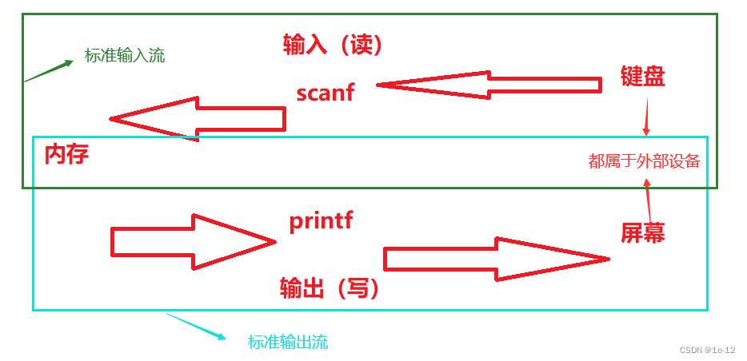
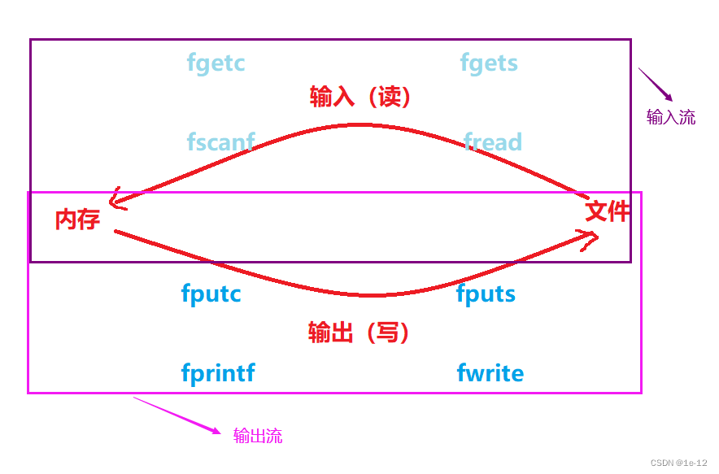
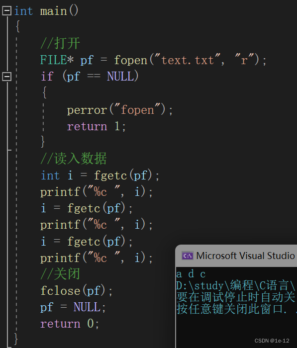
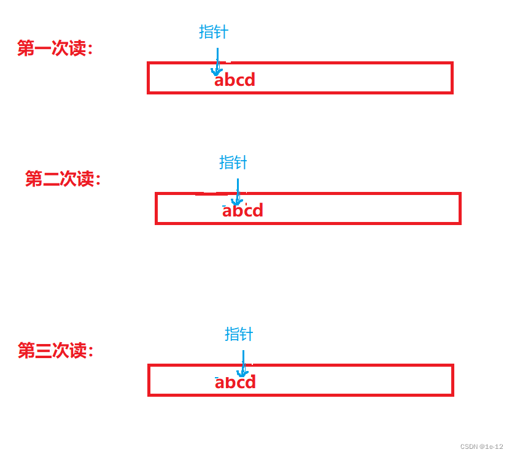
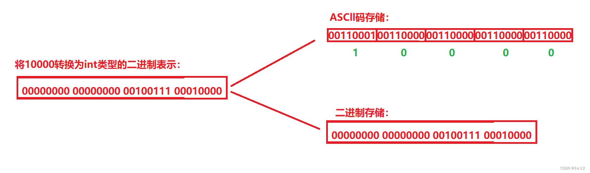

# C语言的文件操作

## 目录
- [C语言的文件操作](#c语言的文件操作)
  - [目录](#目录)
  - [文件指针](#文件指针)
  - [文件操作--打开和关闭](#文件操作--打开和关闭)
    - [文件打开模式](#文件打开模式)
      - [1. `fopen` 函数：](#1-fopen-函数)
  - [文件的读写](#文件的读写)
    - [1. 顺序读写](#1-顺序读写)
      - [`fputc`:](#fputc)
      - [`fgetc`:](#fgetc)
      - [`fgets`：](#fgets)
    - [`fprintf`（这个函数可以向文件输出任何的数据，可以理解这个函数把文件给当作屏幕了）](#fprintf这个函数可以向文件输出任何的数据可以理解这个函数把文件给当作屏幕了)
      - [`fscanf`:](#fscanf)
      - [`fwrite`:](#fwrite)
      - [`fread`:](#fread)
        - [下面是代码实战：](#下面是代码实战)
    - [延伸：`sprintf` 和 `sscanf` 解析](#延伸sprintf-和-sscanf-解析)
      - [`sprintf`:](#sprintf)
      - [`sscanf`:](#sscanf)
    - [2. 随机读写](#2-随机读写)
      - [`fseek`:](#fseek)
      - [`ftell`:](#ftell)
      - [`rewind`:](#rewind)
  - [文本文件和二进制文件](#文本文件和二进制文件)
      - [`feof`](#feof)
    - [文件缓冲区](#文件缓冲区)
      - [`fflush`](#fflush)
      - [`Sleep`](#sleep)

## 文件指针

- 每个被使用的文件都开辟了一个相应的文件信息区，用来存放文件的相关信息。
- 该结构体类型由系统声明，取名为 `FILE`。

```c
struct _iobuf {
     char* ptr;
     int _cnt;
     char* _base;
     int _flag;
     int _charbuf;
     int _bufsiz;
     char* _tmpfname;
};
```

- 不同的 C 编译器的 `FILE` 类型包含的内容不完全相同，但是大同小异。
- 每当打开一个文件的时候，系统会根据文件的情况自动创建一个 `FILE` 结构的变量，并且填充其中的信息，使用者不必关心细节。
- 一般来说通过一个 `FILE` 的指针来维护这个 `FILE` 结构的变量（通过 `FILE` 类型的指针找到文件信息区的起始地址），这样使用起来更加方便。

```c
FILE* pf; // 文件指针变量
```

- 定义 `pf` 是一个指向 `FILE` 类型的指针变量。可以使 `pf` 指向某个文件的文件信息区（是一个结构体变量）。通过该文件信息区中的信息就能够访问文件。也就是说，通过文件指针能够找到与它关联的文件。

## 文件操作--打开和关闭

### 文件打开模式

#### 1. `fopen` 函数：

```c
FILE* pf = fopen("#你的文件路径（相对或者绝对）", "(这里就是下面的参数)");
```

- 这个函数的返回值是一个 `FILE` 类型的指针，在文件成功打开后返回此文件信息区的起始位置，打开失败则返回一个 `NULL`，所以使用 `fopen` 时要使用一个 `FILE` 类型的指针来接受其返回值。

```c
// 打开
FILE* pf = fopen("text.txt", "w"); // 在这里面打文件路径的时候要转义（只要在引号里面都要转义）
// 判断是否打开成功
if (pf == NULL) {
     perror("fopen");
     return 1;
}
```

| 文件使用方式 | 含义 | 如果指定文件不存在 |
| ------------ | ---- | ------------------ |
| "r" (只读)   | 为了输入数据，打开一个已经存在的文本文件 | 出错 |
| "w" (只写)   | 为了输出数据，打开一个文本文件 | 建立一个新的文件 |
| "a" (追加)   | 向文本文件尾添加数据 | 建立一个新的文件 |
| "rb" (只读)  | 为了输入数据，打开一个二进制文件 | 出错 |
| "wb" (只写)  | 为了输出数据，打开一个二进制文件 | 建立一个新的文件 |
| "ab" (追加)  | 向一个二进制文件尾添加数据 | 建立一个新的文件 |
| "r+" (读写)  | 为了读和写，打开一个文本文件 | 出错 |
| "w+" (读写)  | 为了读和写，建一个新的文件 | 建立一个新的文件 |
| "a+" (读写)  | 打开一个文件，在文件尾进行读写 | 建立一个新的文件 |
| "rb+" (读写) | 为了读和写打开一个二进制文件 | 出错 |
| "wb+" (读写) | 为了读和写，新建一个新的二进制文件 | 建立一个新的文件 |
| "ab+" (读写) | 打开一个二进制文件，在文件尾进行读和写 | 建立一个新的文件 |

<p style="text-align: center;">注：当使用 "w", "wb", "w+", "wb+" 打开文件时会清除文件原本存储的数据</p>

- `w+` 和 `w` 区别就是 `w+` 可以读一下。

```c
在使用 "w+" 模式打开文件时，你可以在读和写之间切换，但需要注意文件指针的位置。
为了确保正确的读写操作，你可以使用 fflush、fseek 或 rewind 函数来调整文件指针的位置。
```

```c
#include <stdio.h>
int main() {
     // 以读写模式打开文件
     FILE *pf = fopen("text.txt", "w+");
     if (pf == NULL) {
          perror("fopen");
          return 1;
     }

     // 写入数据
     for (int i = 0; i < 26; i++) {
          fputc('a' + i, pf);
     }

     // 刷新输出缓冲区，确保数据写入文件
     fflush(pf);

     // 将文件指针移到文件开头
     rewind(pf);

     // 读取数据并打印
     char ch;
     while ((ch = fgetc(pf)) != EOF) {
          putchar(ch);
     }

     // 关闭文件
     if (fclose(pf) == EOF) {
          perror("fclose");
          return 1;
     }

     pf = NULL;
     return 0;
}
```

```c
#include <stdio.h> // 这里就是用 fseek 来改变指针的位置

int main() {
     // 以读写模式打开文件
     FILE *pf = fopen("text.txt", "w+");
     if (pf == NULL) {
          perror("fopen");
          return 1;
     }

     // 写入数据
     for (int i = 0; i < 26; i++) {
          fputc('a' + i, pf);
     }

     // 刷新输出缓冲区，确保数据写入文件
     fflush(pf);

     // 将文件指针移到文件开头
     fseek(pf, 0, SEEK_SET);

     // 读取数据并打印
     char
    FILE* pf = fopen("text.txt", "w");
    // 判断是否打开成功
    if (pf == NULL) {
        perror("fopen");
        return 1;
    }
    // 关闭
    if (fclose(pf) == EOF) {
        // 关闭失败
        perror("fclose");
        return 1;
    }
    pf = NULL; // 记得把原本的文件指针置为 NULL，避免野指针的产生。
    return 0;
}
```

## 文件的读写

### 1. 顺序读写

| 功能           | 函数名   | 适用于       |
| -------------- | -------- | ------------ |
| 字符输入函数   | fgetc    | 所有输入流   |
| 字符输出函数   | fputc    | 所有输出流   |
| 文本行输入函数 | fgets    | 所有输入流   |
| 文本行输出函数 | fputs    | 所有输出流   |
| 格式化输入函数 | fscanf   | 所有输入流   |
| 格式化输出函数 | fprintf  | 所有输出流   |
| 二进制输入     | fread    | 文件         |
| 二进制输出     | fwrite   | 文件         |

#### `fputc`:

- 运用示例

```c
int main() {
    // 打开
    FILE* pf = fopen("text.txt", "w");
    // 判断是否打开成功
    if (pf == NULL) {
        perror("fopen");
        return 1;
    }
    // 写入数据
    for (int i = 0; i < 26; i++) {
        fputc('a' + i, pf);
    }
    // 关闭
    if (fclose(pf) == EOF) {
        // 关闭失败
        perror("fclose");
        return 1;
    }
    pf = NULL;
    return 0;
} // 这里就会打印出 a-z；但是这里是不能读的，要 w+ 才能读。
```

#### `fgetc`:

- 这个函数成功读入数据的时候会返回读取字符的 ASCII 值，反之就会返回 `EOF`（-1) 值。

运用示例：

```c
int main() {
    // 打开
    FILE* pf = fopen("text.txt", "r"); // 此时读取文件要用 "r" 的方式打开
    // 判断是否打开成功
    if (pf == NULL) {
        perror("fopen");
        return 1;
    }
    // 读入数据
    int i;
    while ((i = fgetc(pf)) != EOF) {
        printf("%c ", i);
    }
    // 关闭
    if (fclose(pf) == EOF) {
        // 关闭失败
        perror("fclose");
        return 1;
    }
    pf = NULL;
    return 0;
} // 这里也是把 a-z 都给打印了一遍。
```

#### `fgets`：

- 这个函数没有什么可以特别说明的，可以转步到 string 里面来学习。
- 成功后，该函数返回 `str` 的头指针。如果在尝试读取字符时遇到文件结尾，则会设置 `eof` 指示符。如果在读取任何字符之前发生这种情况，则返回的指针为空指针（并且 `str` 的内容保持不变）。如果发生读取错误，则设置错误指示器（`ferror`）并返回空指针（但 `str` 所指向的内容可能已更改）。
- 记住这玩意后面要留位置给 `\0`。

### `fprintf`（这个函数可以向文件输出任何的数据，可以理解这个函数把文件给当作屏幕了）

- `int fprintf(FILE* stream, const char* format, ...)`
- `stream`: 接收指向所要输出文件的指针；
- `format`: 接收将要输出数据的格式（和 `printf` 函数一样由 `%d`, `%x`, `%c`, `%s` 等等格式类型）
- 这个函数会返回输出的字节总数，否则返回一个负数并且报错；// 这个负数没有明确表明是 -1；
- 注意 `printf` 也会返回输出的字节总数，与此同时不会计数 `\0`。
- 所以说 `printf` 和 `fprintf` 本质上是打的字符串，遇到了 `\0` 就会结束，不管这个东西是你手打的还是格式化输入的。

```c
struct S {
    int age;
    char name[20];
    char sex[5];
};

int main() {
    struct S L = { 20, "张三", "男" };
    // 打开
    FILE* pf = fopen("text.txt", "w");
    // 判断是否打开成功
    if (pf == NULL) {
        perror("fopen");
        return 1;
    }
    // 输入数据
    fprintf(pf, "%d %s %s", L.age, L.name, L.sex);
    // 关闭
    if (fclose(pf) == EOF) {
        // 关闭失败
        perror("fclose");
        return 1;
    }
    pf = NULL;
    return 0; // 这里会发现，当你打开这个文件的时候里面多了“20 张三 男”
}
```

#### `fscanf`:

- `int fscanf(FILE* stream, const char* format, ...)`
- `stream`: 接收指向所要输入文件的指针
- `format`: 接收将要输入数据的格式（和 `scanf` 函数一样由 `%d`, `%x`, `%c`, `%s` 等等格式类型）
- 至于后面都是一样的

*运行成功后，该函数返回所读取数据的个数（甚至为 0），如果在读取时发生读取错误或者达到文件的末尾，则会设置正确的指示器（`feof` 或者 `ferror`），而且，如果在成功读取任何数据之前发生任何一种情况，则返回 `EOF`*

```c
struct S {
    int age;
    char name[20];
    char sex[5];
};

int main() {
    struct S s;
    // 打开
    FILE* pf = fopen("text.txt", "r");
    // 判断是否打开成功
    if (pf == NULL) {
        perror("fopen");
        return 1;
    }
    // 输出数据
    fscanf(pf, "%d %s %s", &(s.age), s.name, s.sex);
    printf("%d %s %s", s.age, s.name, s.sex); // 这里的打印就是 20 张三 男
    // 关闭
    if (fclose(pf) == EOF) {
        // 关闭失败
        perror("fclose");
        return 1;
    }
    pf = NULL;
    return 0;
}
```

#### `fwrite`:

- `size_t fwrite(const void* ptr, size_t size, size_t count, FILE* stream);`
  - `ptr`: 接收指向所要输入数据的指针或者地址
  - `size`: 接收输出的每个数据的大小（以字节为单位）
  - `count`: 所要输出数据的个数
  - `stream`: 接收指向所要输出文件的指针
- 成功运行返回输出的数据总数，如果此数字与 `count` 参数不同，则写入错误会组织函数的完成。在这种情况下，将为流设置错误指示器（`ferror`），如果大小或计数为 0，则该函数返回 0，并且错误指示器保持不变。

```c
struct S {
    int age;
    char name[20];
    char sex[5];
};

int main() {
    struct S L = { 20, "李四", "女" };
    // 打开
    FILE* pf = fopen("text.txt", "wb"); // 二进制输出时用 wb
    // 判断是否打开成功
    if (pf == NULL) {
        perror("fopen");
        return 1;
    }
    // 输出数据
    fwrite(&L, sizeof(struct S), 1, pf);
    // 关闭
    if (fclose(pf) == EOF) {
        // 关闭失败
        perror("fclose");
        return 1;
    }
    pf = NULL;
    return 0;
}
```

- 这里的文件是通过二进制的方式向文件输出，记事本中所读取的数据我们肉眼是看不懂的（因为它是以文本形式读取的）。
- 可以用 `fread` 来解决这个问题。

```c
fwrite 函数可以将结构体的数据直接写入文件，因为它是以二进制形式写入的。结构体在内存中的
布局是连续的，fwrite 函数会将这段内存的内容按字节逐个写入文件。

结构体写入文件的原理:
当你使用 fwrite 函数将结构体写入文件时，实际上是将结构体在内存中的二进制表示写入
文件。文件中存储的内容是结构体的二进制数据，而不是可读的文本形式。
```

#### `fread`:

- `size_t fread(void* ptr, size_t size, size_t count, FILE* stream);`

    - `ptr`: 指向存储读取数据的变量的指针或地址
    - `size`: 每次读取数据的大小（以字节为单位）
    - `count`: 读取的次数
    - `stream`: 指向输入文件的指针
    
```c
struct S
{
	int age;
	char name[20];
	char sex[5];
};
int main()
{
	struct S s;
	//打开
	FILE* pf = fopen("text.txt", "rb");//二进制输出时用rb
	//判断是否打开成功
	if (pf == NULL)
	{
		perror("fopen");
		return 1;
	}
	//输入数据
	if (fread(&s, sizeof(struct S), 1, pf) != 0)
	{
		printf("%d %s %s", s.age, s.name, s.sex);
	}
	//关闭
	if (fclose(pf) == EOF)
	{
		//关闭失败
		perror("fclose");
		return 1;
	}
	pf = NULL;
	return 0;
}//这两玩意挺神奇的
```

                 延伸：输入流与输出流
在我们编写的程序中我们可以将程序运行时的内存数据通过printf函数输入到屏幕，也可以将键盘上的数据通过scanf函数输入到内存中，这两种从屏幕输出数据和从键盘输入数据的方式分别被称为标准输出流和标准输入流：
                 


- 文件操作如下：


```
-  stdin——标准输入流——键盘

-  stdout——标准输出流——屏幕

-  stderr ——标准错误流——屏幕
```
- 也就是在C程序运行时，系统自动打开三个FILE*类型的流：stdin（接收键盘数据），stdout（接收所要向屏幕输出的数据），stderr（接收所要向屏幕输出的数据）。

##### 下面是代码实战：
- 1
```c
int main()
{
	int ch = fgetc(stdin);
	fputc(ch, stdout);
	return 0;//这个就是我们常用的
}
```

- 2
```c

int main()
{
	int a;
	fscanf(stdin, "%d", &a);
	fprintf(stdout, "%d", a);
	return 0;
}//这里等价于printf和scanf
```
### 延伸：`sprintf` 和 `sscanf` 解析

从上述延伸可以发现，`scanf` 和 `printf` 函数是对应于标准输入输出流，`fscanf` 和 `fprintf` 函数（都包含在头文件 `stdio.h` 中）对应于所有输入输出流。另外还有 `sscanf` 函数和 `sprintf` 函数，它们可以实现字符串和各种类型数据的相互转换。

#### `sprintf`:

- `int sprintf(char* str, const char* format, ...)`
    - `str`: 指向存储输出数据的字符串
    - `format`: 输出数据的格式（与 `printf` 函数类似，由 `%d`, `%x`, `%c`, `%s` 等格式类型组成）

示例：

```c
#include <stdio.h>

int main() {
        char buffer[50];
        int age = 25;
        char name[] = "Alice";
        sprintf(buffer, "Name: %s, Age: %d", name, age);
        printf("%s\n", buffer); // 输出: Name: Alice, Age: 25
        return 0;
}
```

#### `sscanf`:

- `int sscanf(const char* str, const char* format, ...)`
    - `str`: 指向存储输入数据的字符串
    - `format`: 输入数据的格式（与 `scanf` 函数类似，由 `%d`, `%x`, `%c`, `%s` 等格式类型组成）

示例：

```c
#include <stdio.h>

int main() {
        char buffer[] = "Name: Bob, Age: 30";
        char name[20];
        int age;
        sscanf(buffer, "Name: %s, Age: %d", name, &age);
        printf("Name: %s, Age: %d\n", name, age); // 输出: Name: Bob, Age: 30
        return 0;
}
```

```c
struct S
{
	int age;
	char name[20];
	float point;
};
int main()
{
	struct S l = { 15,"lisi",88.9f };
	char arr[20];
	struct S j = { 0 };
	//将各类型数据转换为字符串
	sprintf(arr, "%d %s %.1f", l.age, l.name, l.point);
	printf("%s\n", arr);
	//将字符串数据转换为各种类型
	sscanf(arr, "%d %s %f", &(j.age), j.name, &(j.point));
	printf("%d %s %.1f", j.age, j.name, j.point);
	return 0;
```
### 2. 随机读写

在读写文件时，我们不仅可以按顺序读写，还可以随机读写（从文件的某一位置开始读写）。

在介绍随机读写函数之前，我们需要了解一下文件指针的偏移。

以下是一个示例：

首先，我们创建一个名为 `text.txt` 的文件。
然后写下面这一个代码


仔细观察发现fgetc函数每读完一次数据时下一次再重新读取时不会从文件开始的位置去读，
而是从上一次读取结束的地方再次读取，这实际是FILE*类型的指针的偏移：



#### `fseek`:

- `int fseek(FILE* stream, long int offset, int origin);`
    - `stream`: 指向文件的指针
    - `offset`: 偏移量，以字节为单位
    - `origin`: 偏移的起始位置，可以是以下三个常量之一：
        - `SEEK_SET`: 文件开头
        - `SEEK_CUR`: 当前位置
        - `SEEK_END`: 文件末尾

示例：

```c
#include <stdio.h>

int main() {
        FILE* pf = fopen("text.txt", "r");
        if (pf == NULL) {
                perror("fopen");
                return 1;
        }

        // 将文件指针移动到文件开头
        fseek(pf, 0, SEEK_SET);

        // 读取数据并打印
        char ch;
        while ((ch = fgetc(pf)) != EOF) {
                putchar(ch);
        }

        // 关闭文件
        if (fclose(pf) == EOF) {
                perror("fclose");
                return 1;
        }

        pf = NULL;
        return 0;
}
```

#### `ftell`:

- `long int ftell(FILE* stream);`
    - `stream`: 指向文件的指针
    - 返回值：当前文件指针的位置，以字节为单位

示例：

```c
#include <stdio.h>

int main() {
        FILE* pf = fopen("text.txt", "r");
        if (pf == NULL) {
                perror("fopen");
                return 1;
        }

        // 获取当前文件指针的位置
        long int pos = ftell(pf);
        printf("Current position: %ld\n", pos);

        // 关闭文件
        if (fclose(pf) == EOF) {
                perror("fclose");
                return 1;
        }

        pf = NULL;
        return 0;
}
```

#### `rewind`:

- `void rewind(FILE* stream);`
    - `stream`: 指向文件的指针
    - 功能：将文件指针重新定位到文件的开头，并清除文件的错误和EOF标志

示例：

```c
#include <stdio.h>

int main() {
        FILE* pf = fopen("text.txt", "r");
        if (pf == NULL) {
                perror("fopen");
                return 1;
        }

        // 读取并打印文件内容
        char ch;
        while ((ch = fgetc(pf)) != EOF) {
                putchar(ch);
        }

        // 将文件指针重新定位到文件开头
        rewind(pf);

        // 再次读取并打印文件内容
        while ((ch = fgetc(pf)) != EOF) {
                putchar(ch);
        }
        printf("%d", ftell(pf));
        // 关闭文件
        if (fclose(pf) == EOF) {
                perror("fclose");
                return 1;
        }

        pf = NULL;
        return 0;
}
```

## 文本文件和二进制文件

根据数据的组织形式，数据文件被分为文本文件和二进制文件。

> 数据在内存中以二进制的形式存储，如果不加转换地输出到外存（如磁盘文件），就是二进制文件。

> 如果要求在外存上以 ASCII 码的形式存储，则需要在存储前进行转换。以 ASCII 字符形式存储的文件就是文本文件。

> 数据在内存中字符一律以 ASCII 形式存储，数值型数据既可以用 ASCII 形式存储，也可以使用二进制形式存储。

例如，存储数据 `10000` 时，用 ASCII 码存储需要 5 个字节（因为 `10000` 是五位数，每一位数都要用一个字节的 ASCII 码来表示），而用二进制存储只需要 4 个字节（一个整型大小为 4 字节）。

- 以下是不同的存储格式

下面我们使用二进制存储的方式存入10000这个数据：
```c
int main()
{
	//打开
	FILE* pf = fopen("text.txt", "wb");
	if (pf == NULL)
	{
		perror("fopen");
		return 1;
	}
	//存入
	int a = 10000;
	fwrite(&a, sizeof(int), 1, pf);
	//关闭
	fclose(pf);
	pf = NULL;
	return 0;
}
```
将二进制文件添加到编译器中使用二进制编译器的打开方式打开：
可以看到 10000 这个数据在二进制中存储为 `10 27 00 00`（前面 `00000000` 是地址不需要在意）。`10 27 00 00` 是将二进制数据转换为十六进制并以小端存储方式显示的。              
#### `feof`

- `feof` 函数用于检查文件流是否到达文件末尾。
- 函数原型：`int feof(FILE *stream);`
  - `stream`：接收指向所要检查的文件指针。
- 返回值：
  - 如果文件流到达文件末尾，`feof` 返回一个非零值（通常为 1）。
  - 如果文件流未到达文件末尾，`feof` 返回 0。

*以下是一个示例，展示了如何使用 `feof` 函数：*

```c
#include <stdio.h>

int main() {
    // 打开文件
    FILE *pf = fopen("text.txt", "r");
    if (pf == NULL) {
        perror("fopen");
        return 1;
    }

    // 读取数据并打印
    char ch;
    while ((ch = fgetc(pf)) != EOF) {
        putchar(ch);
    }

    // 检查是否到达文件末尾
    if (feof(pf)) {
        printf("\n已到达文件末尾\n");
    } else {
        printf("\n未到达文件末尾\n");
    }

    // 关闭文件
    if (fclose(pf) == EOF) {
        perror("fclose");
        return 1;
    }

    pf = NULL;
    return 0;
}
```
### 文件缓冲区

ANSI C 标准采用“缓冲文件系统”处理数据文件。所谓缓冲文件系统是指系统自动地在内存中为程序中每一个正在使用的文件开辟一块“文件缓冲区”。从内存向磁盘输出数据会先送到内存中的缓冲区，装满缓冲区后才一起送到磁盘上。如果从磁盘向计算机读入数据，则从磁盘文件中读取数据输入到内存缓冲区（充满缓冲区），然后再从缓冲区逐个地将数据送到程序数据区（程序变量等）。缓冲区的大小由 C 编译系统决定。

- 以下例子来感受缓冲区存在：
```c
int main()
{
	//打开
	FILE* pf = fopen("text.txt", "wb");
	if (pf == NULL)
	{
		perror("fopen");
		return 1;
	}
	//存入
	int a = 10000;
	fwrite(&a, sizeof(int), 1, pf);
	printf("此20秒数据在文件缓冲区内，打开文件是没有数据的\n");
	Sleep(20000);//睡眠10秒
	fflush(pf);//此函数可以刷新缓冲区中的数据，使其存入硬盘文件中
	printf("此20秒数据从文件缓冲区内读入到文件中，打开文件是有数据的\n");
	Sleep(20000);
	//关闭
	fclose(pf);
	pf = NULL;
	return 0;
}
```
这里可以得出一个结论: 
因为有缓冲区的存在，C语言在操作文件的时候，需要做刷新缓冲区或者在文件操作结束的时候关闭文件。
如果不做，可能导致读写文件的问题

#### `fflush`

- `fflush` 函数用于刷新输出缓冲区，将缓冲区中的数据写入到文件或终端。
- 函数原型：`int fflush(FILE *stream);`
  - `stream`：接收指向要刷新的文件指针。如果 `stream` 为 `NULL`，则刷新所有打开的输出流。
- 返回值：
  - 成功时返回 0。
  - 失败时返回 EOF，并设置错误指示器。

*以下是一个示例，展示了如何使用 `fflush` 函数：*

```c
#include <stdio.h>
#include <windows.h>

int main() {
    // 打开文件
    FILE* pf = fopen("text.txt", "wb");
    if (pf == NULL) {
        perror("fopen");
        return 1;
    }

    // 存入数据
    int a = 10000;
    fwrite(&a, sizeof(int), 1, pf);
    printf("此20秒数据在文件缓冲区内，打开文件是没有数据的\n");
    Sleep(20000); // 睡眠20秒
    fflush(pf); // 刷新缓冲区中的数据，使其存入硬盘文件中
    printf("此20秒数据从文件缓冲区内读入到文件中，打开文件是有数据的\n");
    Sleep(20000); // 睡眠20秒

    // 关闭文件
    fclose(pf);
    pf = NULL;
    return 0;
}
```
#### `Sleep`

- `Sleep` 函数用于暂停程序的执行一段时间。
- 函数原型：`void Sleep(DWORD dwMilliseconds);`
  - `dwMilliseconds`：暂停的时间，单位为毫秒。
- 返回值：无。

*以下是一个示例，展示了如何使用 `Sleep` 函数：*

```c
#include <stdio.h>
#include <windows.h>

int main() {
    printf("程序暂停 5 秒...\n");
    Sleep(5000); // 睡眠5秒
    printf("程序继续执行。\n");
    return 0;
}


