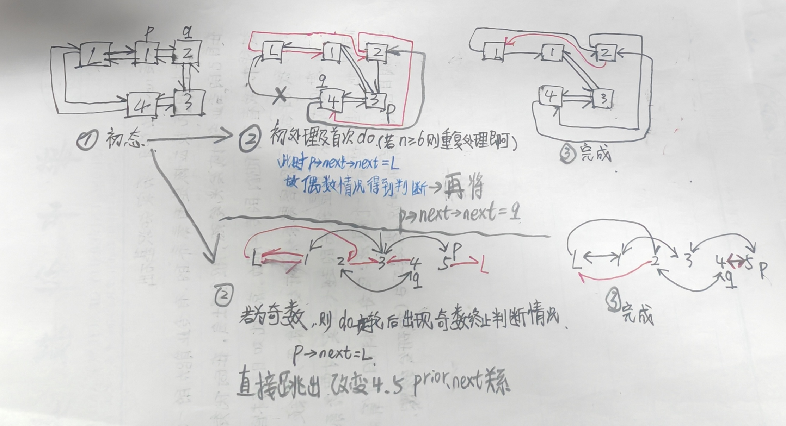

## 题目：
设以带头结点的双向循环链表表示线性表L=（a1，a2，...，an），试编写一个时间复杂度为O(n)的算法，将L改变成L=（a1，a3，...，an，...，a4，a2）。
## 输入输出示例：
测试输入：6 
1 2 3 4 5 6
预期输出：1 3 5 6 4 2

测试输入：11
2 11 3 5 7 6 12 13 8 9 20 
预期输出：2 3 7 12 8 20 9 13 6 5 11
## 思路：
* #### 1.拆成奇数偶数两条链再连上去。
* #### 2.直接操作原链。
## 代码实现：
### 主函数
```c
#include <stdio.h>
#include <stdlib.h>
typedef int ElemType;
typedef  struct  Dnode
    {
        ElemType     data;
        struct  Dnode *prior,*next;
    } *DuLinkList;
int main()
{
    DuLinkList L,p,tail;
    int n,i;
    L=tail=(DuLinkList)malloc(sizeof(struct Dnode));
    scanf("%d",&n);
    for(i=1;i<=n;i++)
    {
        p=(DuLinkList)malloc(sizeof(struct Dnode));
        scanf("%d",&p->data);
        tail->next=p;
        p->prior=tail;
        tail=p;
    }
    L->prior=tail;
    tail->next=L;
    adjust(L);
    p=L->next;
    while(p!=L)
    {
        printf(" %d",p->data);
        p=p->next;
    }
}
```
* 创建了双向链表，L为空头，L->next为第一个节点

### 功能函数
#### <h4 style="color:blue">思路一</h4>
```c
void adjust(DuLinkList L) {
     DuLinkList odd = L->next;  // 奇数位置节点
    DuLinkList even = odd->next;  // 偶数位置节点
    DuLinkList evenHead = even;  // 保存偶数链表的头节点

    // 分离奇数和偶数位置的节点
    while (even != L && even->next != L) {
        odd->next = even->next;
        odd->next->prior = odd;
        odd = odd->next;

        even->next = odd->next;
        even->next->prior = even;
        even = even->next;
    }

    // 连接奇数链表和偶数链表
    odd->next = evenHead;
    evenHead->prior = odd;

    // 修复偶数链表的尾节点指向头节点
    if (even != L) {
        even->next = L;
        L->prior = even;
    } else {
        odd->next = L;
        L->prior = odd;
    }
}
```
* 此其为将123456变135246，实则为在原链上进行操作
稍改一下变：
```c
int flag=1;
    DuLinkList odd = L->next;  // 奇数位置节点
    DuLinkList even = odd->next;  // 偶数位置节点
    DuLinkList evenHead = even; //记录头部（实则是顺序的尾部）

    // 分离奇数和偶数位置的节点
    while (flag) {
        odd->next = even->next;
        odd->next->prior = odd;
        odd = odd->next;

        if(odd->next==L) break;
        even->prior = odd->next;
        if(odd->next->next==L) flag=0;//偶
        even->prior->next = even;
        even = even->prior;
    }


    // 连接奇数链表和偶数链表
    odd->next = even;
    even->prior = odd;

    // 修复偶数链表的尾节点指向头节点
        evenHead->next = L;
        L->prior = evenHead;
```
* 这样实则就与思路二写法无异了，还是过不了会陷入死循环

#### lzk's
```c
void adjust(DuLinkList L) {
    if (L == NULL || L->next == L || L->next->next == L) {
        return;  // 链表为空或只有一个元素时，不需要调整
    }

    DuLinkList oddlist, evenlist, oddtail, eventail;
    oddlist = (DuLinkList)malloc(sizeof(struct Dnode));
    evenlist = (DuLinkList)malloc(sizeof(struct Dnode));
    oddtail = oddlist;
    eventail = evenlist;

    oddlist->next = oddlist;
    evenlist->next = evenlist;
    oddlist->prior = oddlist;
    evenlist->prior = evenlist;

    DuLinkList p = L->next;
    int cnt = 1;
    // 遍历链表，将奇数位置节点和偶数位置节点分别存入两个链表
    while (p != L) {
        DuLinkList next = p->next;  // 保存下一个节点
        if (cnt % 2 == 1) {  // 奇数位置节点
            oddtail->next = p;
            p->prior = oddtail;
            oddtail = p;
        } else {  // 偶数位置节点
            eventail->prior = p;
            p->next = eventail;
            eventail = p;
        }
        cnt++;
        p = next;  // 移动到下一个节点
    }

    // 合并
    oddtail->next = eventail;
    eventail->prior = oddtail;
    L->next = oddlist->next;
    oddlist->next->prior = L;
    evenlist->prior->next = L;
    L->prior = eventail->prior;
    //oddtail->next = evenlist->next;
    //if (evenlist->next != L) {
    //    evenlist->next->prior = oddtail;
    //}
    /* evenlist->prior->next = L;
    L->prior = eventail->prior;
    L->next = oddlist->next;
    oddlist->next->prior = L;
    */
    //eventail->next = L;
    //L->prior = eventail;
    free(oddlist);
    free(evenlist);
}
```
* 利用cnt控制一步步走就不需考虑太多了

#### <h4 style="color:blue">思路二</h4>
```c
void adjust(DuLinkList L) {
    int flag=1;
    DuLinkList p=L->next,q;
    q=p->next;
    L->prior=q;
    do{
        p->next=q->next;
        q->next->prior=p;
        p=q->next;//p=p->next;

        if(p->next==L) {
            flag=2;    
            break;
        }//奇数 终止 

        q->prior=p->next;
        if(p->next->next==L) flag=0;//偶数 终止 
        p->next->next=q;
        q=p->next;//q=q->prior;

    }while(flag);

    if(flag==2) {
        p->next=q;
        q->prior=p;
    }

    L->prior->next=L;
}
```

* 为何不行？？？？理论上计算机一步步走不会出现二义性和死循环呀

